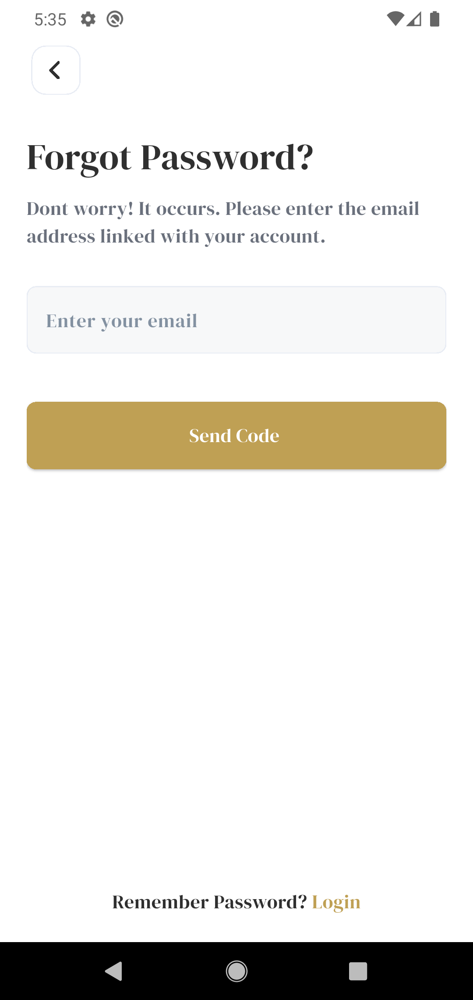
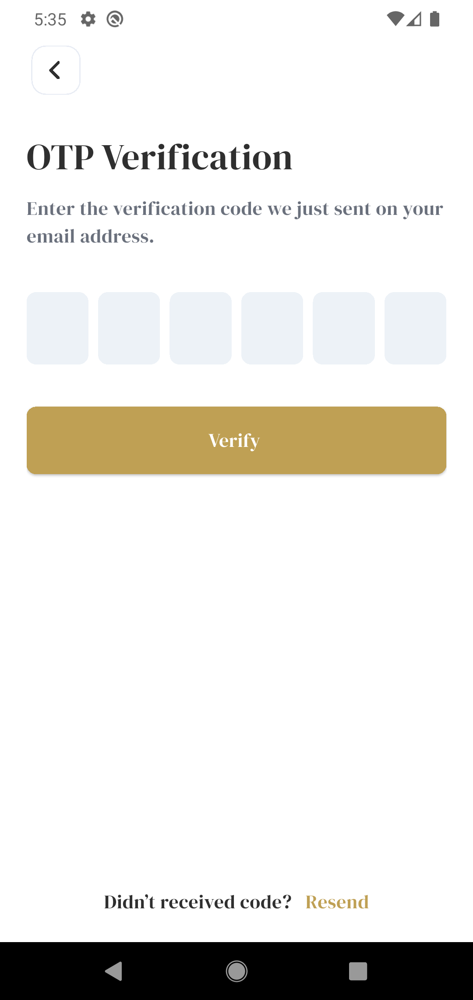
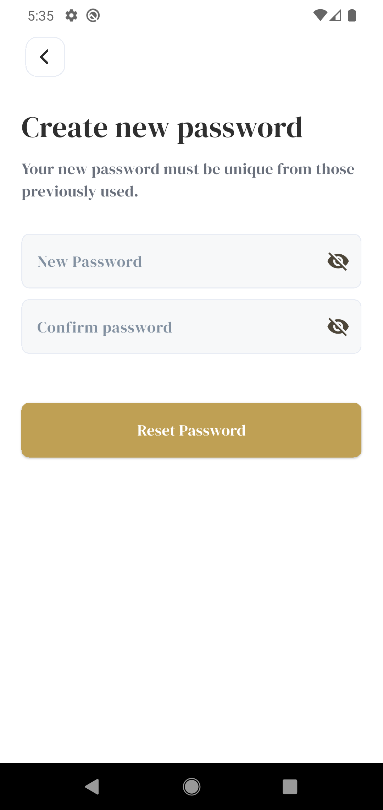
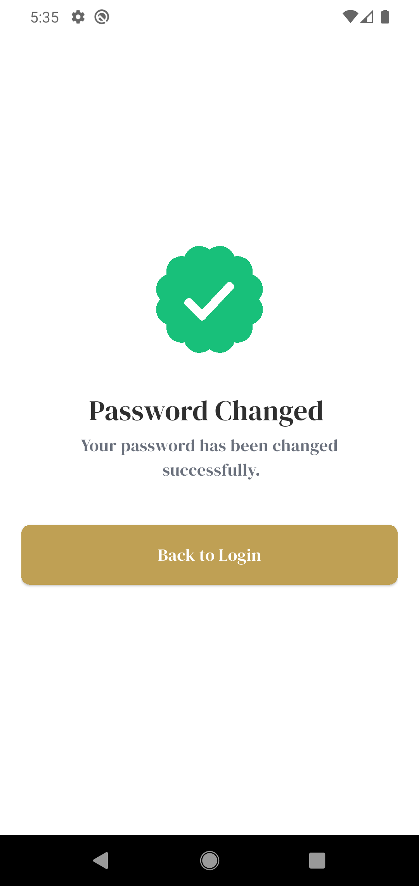
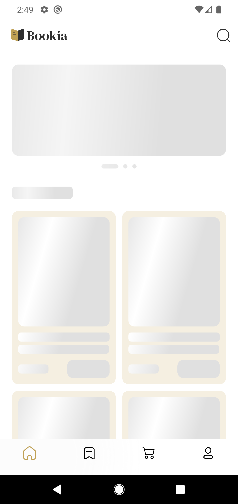
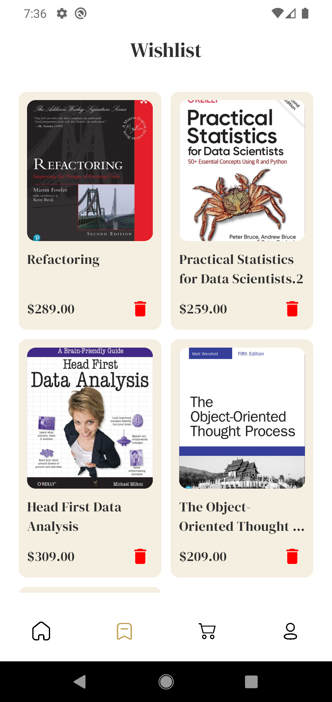

# Bookia Appstore
Elevating the Digital Reading Experience.

Bookia is a modern, high-performance, and cross-platform application that revolutionizes how users discover, acquire, and read digital literature. With its intuitive interface, Bookia provides a seamless and frictionless gateway to a world of knowledge.

## Screenshots

### Welcome & Splash
| Welcome Screen | Splash Screen |
|:--------------:|:-------------:|
|  |  |

---

### Auth Screens
| Login Screen | Register Screen |
|:------------:|:---------------:|
|  |  |

---

### Password Recovery
| Forgot Password | OTP Verification | Create Password | Password Changed |
|:---------------:|:----------------:|:---------------:|:----------------:|
|  |  |  |  |

---
### Home Screen
| Home Screen || shimmer Screen || details Screen | wishlist Screen |
|:-------------:||:-------------:||:-------------:||:-------------:|
|  ||  ||  ||  |

