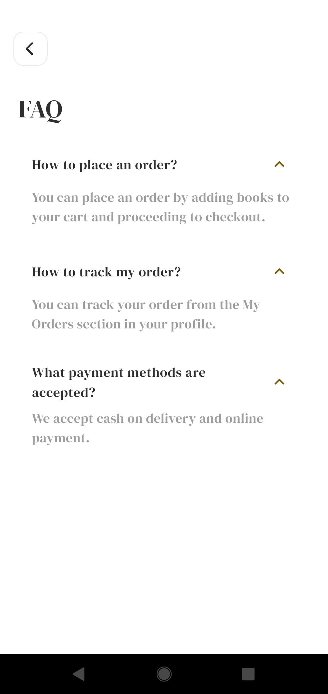
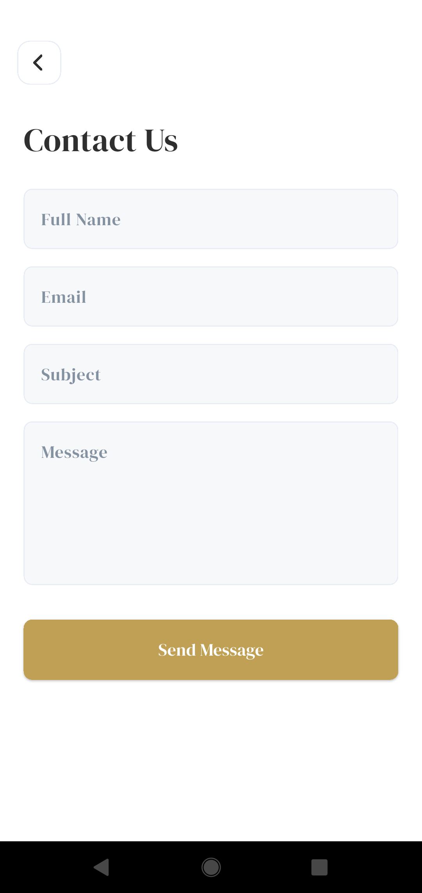

# 📚 Bookia — Modern Flutter Bookstore App


**Bookia** is a premium Bookstore application built with **Flutter**, featuring a sleek modern design, robust feature-based architecture, and full backend integration. This project demonstrates advanced Flutter concepts, including multi-language support (English & Arabic), real-time API communication, and efficient state management using Cubit.

---

## ✨ Key Features & Highlights

### 🔐 Authentication Flow
- **Onboarding:** Professionally designed Splash and Welcome screens.
- **Login/Register:** Complete with validation, social auth buttons, and API integration.
- **Enhanced Security:** Forgot password, OTP verification, and secure password reset.

### 📚 Product Discovery & Details
- **Dynamic Content:** Home screen with auto-sliding banners and "Best Seller" collections fetched from APIs.
- **Search System:** Real-time search by book title with input debouncing for performance.
- **Rich Details:** Comprehensive book detail screen including descriptions, pricing, and actions.

### 🛒 Cart & Wishlist Management
- **Persistence:** Local caching of wishlist and cart IDs for instant UI feedback.
- **Dynamic Cart:** Real-time quantity updates, removal, and automatic total price calculation.
- **Wishlist Sync:** Seamlessly add or remove books from your favorites list.

### 📦 Order Tracking & History
- **Place Order:** Multi-step process including checkout verification and governorate selection.
- **Order Tracking:** Detailed order history with status checks and single-order retrieval by ID.
- **Detailed Summaries:** Breakdown of delivery addresses, ordered items, and payment summaries.

### 👤 Profile & Settings
- **Identity:** Edit personal info (Name, Phone, Address) and upload a profile picture.
- **Security:** In-app reset password functionality.
- **Session Management:** Secure token-based logout with cleared local cache.
- **Support:** Integrated **FAQ** and **Contact Us** forms for user assistance.

### 🌍 Localization & Multi-Language
- **Full RTL Support:** Seamless transitions between Arabic and English.
- **Dynamic Translations:** All UI strings, hints, and error messages are localized using `easy_localization`.
- **Locale Persistence:** The app remembers the user's language preference across sessions.


---

## 📱 Screenshots Preview

### 🧩 App Identity

|                    App Icon                   |
| :-------------------------------------------: |
|  |

---

### 🔹 Onboarding & Authentication
| Splash | Welcome | Login | Register |
|:---:|:---:|:---:|:---:|
|  |  |  |  |

| Forgot Password | OTP Verification | New Password | Success |
|:---:|:---:|:---:|:---:|
|  |  |  |  |

### 🔹 Home, Search & Details
| Home  | Search Results | Book Details |
|:---:|:---:|:---:|
|  |  |  |

### 🔹 Wishlist, Cart & Checkout
| Wishlist | Cart | Place Order | Order Success |
|:---:|:---:|:---:|:---:|
|  |  |  |  |

### 🔹 Profile & Orders History
| Profile | Edit Profile | My Orders | Order Details |
|:---:|:---:|:---:|:---:|
|  |  |  |  |

---
### ℹ️ Help & Support

|                      FAQ                     |                     Contact Us                     |
| :------------------------------------------: | :------------------------------------------------: |
|  |  |

💡 *Support system to enhance user trust and experience.*

---

## 🛠 Tech Stack & Packages

- **Core:** [Flutter SDK](https://flutter.dev) (3.x), [GoRouter](https://pub.dev/packages/go_router) for deep-linkable routing.
- **State Management:** [Flutter Bloc / Cubit](https://pub.dev/packages/flutter_bloc) for predictable state flows.
- **Networking:** [Dio](https://pub.dev/packages/dio) for efficient HTTP requests and interceptors.
- **Local Storage:** [SharedPreferences](https://pub.dev/packages/shared_preferences) for token and locale persistence.
- **UI Enhancements:**
  - [Flutter SVG](https://pub.dev/packages/flutter_svg) for high-quality icons.
  - [Shimmer](https://pub.dev/packages/shimmer) for skeleton loading.
  - [Carousel Slider](https://pub.dev/packages/carousel_slider) & [Smooth Page Indicator](https://pub.dev/packages/smooth_page_indicator).
  - [Cached Network Image](https://pub.dev/packages/cached_network_image) for optimized image loading.
  - [Pinput](https://pub.dev/packages/pinput) for smooth OTP inputs.
  - [Easy Localization](https://pub.dev/packages/easy_localization) for multi-language support.
  
---

## 🏗 Project Architecture

The app follows a professionally structured **Feature-Based Architecture**, ensuring high maintainability and scalability.

```text
    lib/
    ├── app.dart           # App-level config (Routes, Themes, Locales)
    ├── core/
    │   ├── constants/              # Fonts, Images, Strings
    │   ├── cubits/                 # Global Cubits (AppCubit)
    │   ├── localization/           # Multi-language logic
    │   ├── services/               # API (Dio) and Local (SharedPref) services
    │   ├── styles/                 # Colors and Typography
    │   └── widgets/                # Common reusable components (MainButtons, Shimmers)
    ├── features/
    │   ├── auth/                   # Authentication screens and business logic
    │   ├── home/                   # Main Home and Search modules
    │   ├── orders/                 # History and Details of orders
    │   ├── cart/                   # Shopping Cart logic
    │   ├── wish_list/              # Managed favorites
    │   ├── profile_folder/         # User management components
    │   ├── support/                # FAQ and Contact Us forms
    │   └── welcome/                # Onboarding flow
    └── main.dart                   # Entry point
```

---

## 🧠 State Management Patterns

The project utilizes **Cubits** for predictable state isolation per feature:

| Cubit | Responsibility |
|---|---|
| **AppCubit** | Global locale management and persistence. |
| **AuthCubit** | Login, Registration, OTP, and Password Reset flows. |
| **HomeCubit** | Banners and Best Seller catalogs fetch. |
| **CartCubit** | Item management, quantity updates, and Checkout request. |
| **WishListCubit** | Management of favorite items and local ID synchronization. |
| **SearchCubit** | Real-time product search and catalog loading. |
| **MyOrderCubit** | Fetching and filtering order history. |
| **EditProfileCubit** | Managing user profile updates and image selection. |

---

## 🚀 Getting Started

### Prerequisites
- Flutter SDK (3.10.8)
- Android Studio / VS Code
- Stable Internet Connection for API calls

### Installation
1. **Clone the repo:**
   ```bash
   git clone https://github.com/[your-username]/bookia.git
   ```
2. **Install dependencies:**
   ```bash
   flutter pub get
   ```
3. **Run the app:**
   ```bash
   flutter run
   ```

---

## 👨‍💻 Developed By

**Yousef Ahmed**  
*Flutter Developer*


### 📬 Contact & Collaboration

- **GitHub:** https://github.com/Yousefahmed168
- **LinkedIn:** https://www.linkedin.com/in/yousef-turk/
- **Email:** tourkousef@gmail.com
- **Mobile:** +01557204387

---

### ⭐ Show your support
If you find this project helpful for your learning, please give it a star! It helps more people discover this repository.